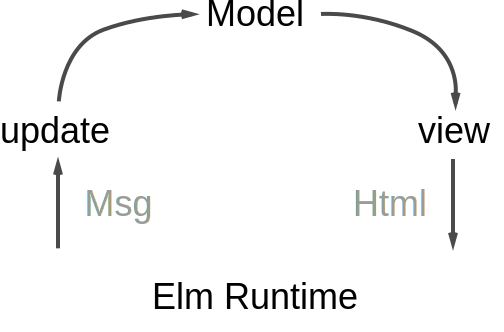

# Step1. Elmアーキテクチャで始めるHello World!!!

ここではElmアーキテクチャを使ってHello Worldしてみます。

## Elmアーキテクチャ
- Elmアーキテクチャとは、Elmが提供するアプリケーションのフロー的な仕組み
- アプリケーションは __Elmアプリケーションに沿って作ることを前提としている__
  - つまり、Elm言語とは別にフレームワークを考える必要がない
- 英語だとThe Elm Architecture。TEAと略されることもある。



- Model
  - アプリケーションの全ての状態(データ)を表す。つまり状態を管理するところはここだけとなる。
- View
  - Modelを使ってHTML(DOM)を生成する関数
- Msg
  - アプリケーションで起きたコトを表すデータ。例えば、ボタンを押されたイベントや、リンクをクリックされたイベントとか。これらをMsgとして表現する。
  - イベントが発生すると、Elm Runtimeを通してイベントに該当するMsgをUpdateに渡す。
- Update
  - Msgを解釈して、`現在のModel -> 新しいModel` に変換する関数

## 試してみる
`setp1/HelloWorld.elm`ファイルを開いて、Hello Worldを完成してみましょう！

ソースコードの以下の部分の`test`を`Hello World`に変更します。

```
view : Model -> Html Msg
view model =
    text "test"
```

ファイルを保存してから、ブラウザから`http://localhost:8000/step1/HelloWorld.elm`にアクセスします。

ブラウザの検証ツールでHTMLがどのようになっているかも見てみましょう。

再度ソースを変更したあとに画面表示を確かめたいときには、画面をリロードして下さい。


## 関数について
ここで触った`view`は関数です。

```
view : Model -> Html Msg
view model =
    text "test"
```

1行目は型注釈(Type Annotation)と言って、関数名、引数の型、戻り値の型を定義します。  
`->`が引数及び戻り値の区切りとなります。

2行目以降が関数の本体となります。

なのでこの`view`関数は

- 引数として`Model`型を受け取り、戻り値として`Html Msg`型を返す
- `Html Msg`とは？となると思いますが、ここではHTML要素を表す型と理解して下さい。  
  - `text`関数に`String`型を渡すと、HTML上ではplain textを表すHTML要素を返します。

- 引数が2個の関数の場合は以下となります。

```
add : Int -> Int -> Int
add x y=
    x + y

-- 使用例
add 1 2
3 
```

この関数は、`Intの引数 -> Intの引数 -> Intの戻り値` という関数と読みます。

ちなみに`--`はコメントを表します。
